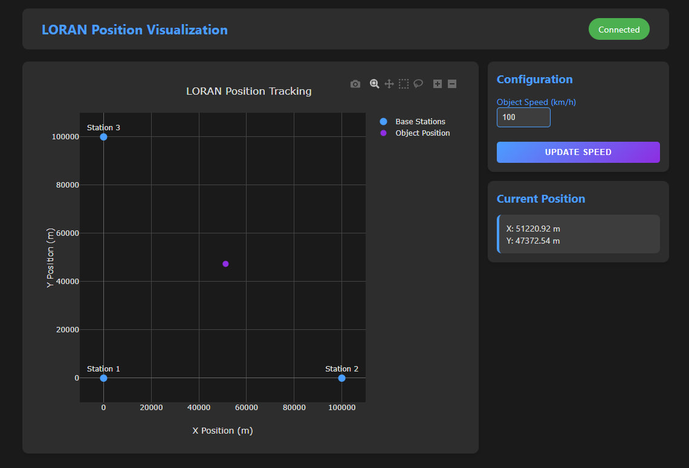
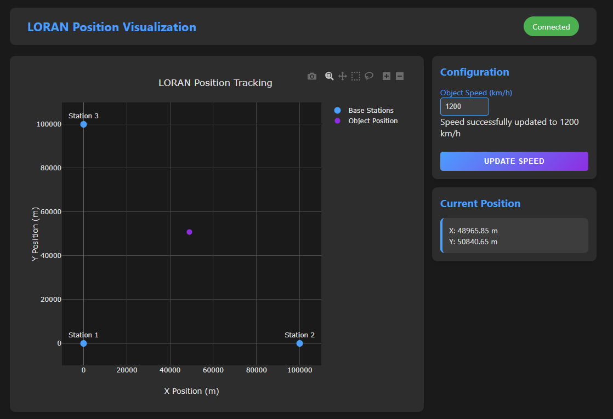

# Лабораторна робота №6
Codepen: https://codepen.io/Min-Max_Reid/full/jOgJKaj
## Розробка додатку для візуалізації вимірювань LORAN

### Мета роботи
Розробити програмне забезпечення для візуалізації даних навігаційної системи LORAN. Додаток повинен отримувати дані через WebSocket з'єднання від емульованої вимірювальної частини LORAN, обробляти їх за допомогою методу найменших квадратів, та відображати положення об'єкта і базових станцій на графіку в декартових координатах.

### Короткі відомості
LORAN (Long Range Navigation) - це наземна система радіонавігації великої дальності, яка використовує принцип гіперболічного позиціювання для визначення місцезнаходження об'єктів. Система працює шляхом вимірювання різниці в часі прибуття низькочастотних радіосигналів від декількох синхронізованих передавачів. За допомогою цих вимірювань можна визначити положення приймача на перетині гіперболічних ліній положення.

Система LORAN була розроблена під час Другої світової війни і стала однією з перших глобальних систем радіонавігації. Незважаючи на появу супутникових систем навігації, LORAN продовжує використовуватись як резервна система через її стійкість до атмосферних перешкод та незалежність від супутникового сегменту.

Принцип роботи LORAN базується на вимірюванні різниці часу прибуття (TDoA - Time Difference of Arrival) сигналів від базових станцій. У системі використовуються наземні передавачі, розташовані на відомих координатах, які синхронно передають радіосигнали. Приймач вимірює різницю в часі прибуття цих сигналів, що дозволяє визначити його положення на перетині двох або більше гіперболічних ліній.

Для визначення положення об'єкта в двовимірному просторі необхідні мінімум три базові станції. Кожна пара станцій формує гіперболу, на якій може знаходитись об'єкт. Перетин двох таких гіпербол дає точне положення приймача. Точність визначення координат залежить від геометричного розташування базових станцій, якості синхронізації їх роботи та умов поширення радіосигналів.

В рамках даної лабораторної роботи реалізується емуляція системи LORAN з використанням сучасних технологій веб-розробки та методів чисельної оптимізації для визначення координат об'єкта. Це дозволяє на практиці дослідити принципи роботи гіперболічних навігаційних систем та методи обробки навігаційних даних.

### Завдання роботи
Основним завданням є створення системи, яка дозволяє в режимі реального часу відслідковувати положення об'єкта відносно трьох базових станцій LORAN. Система має забезпечувати точне визначення координат об'єкта на основі різниці часу прибуття сигналів (TDoA) від базових станцій, використовуючи метод гіперболічного позиціювання. 

Для реалізації поставленої мети необхідно розробити веб-додаток, який буде взаємодіяти з емулятором LORAN через WebSocket протокол, здійснювати необхідні математичні розрахунки для визначення положення об'єкта та візуалізувати отримані результати. Також важливою частиною завдання є реалізація можливості зміни параметрів системи через API для дослідження роботи системи в різних умовах.


## Програмна реалізація

``` html
<!DOCTYPE html>
<html lang="en">
<head>
    <meta charset="UTF-8">
    <meta name="viewport" content="width=device-width, initial-scale=1.0">
    <title>LORAN Visualization</title>
</head>
<body>
    <div class="app-container">
        <header class="app-header">
            <h1>LORAN Position Visualization</h1>
            <div id="connection-status">Disconnected</div>
        </header>

        <div class="main-content">
            <div class="visualization-panel">
                <div id="chart" class="plot-container"></div>
            </div>

            <div class="control-sidebar">
                <div class="settings-card">
                    <h2>Configuration</h2>
                    <div class="settings-form">
                        <div class="form-group">
                            <label for="speedInput">Object Speed (km/h)</label>
                            <input type="number" id="speedInput" min="0" max="1000" value="100">
                        </div>
                        <button id="updateConfig" class="primary-button">Update Speed</button>
                    </div>
                </div>

                <div class="data-card">
                    <h2>Current Position</h2>
                    <div class="position-info">
                        <p>X: <span id="posX">-</span> m</p>
                        <p>Y: <span id="posY">-</span> m</p>
                    </div>
                </div>
            </div>
        </div>
    </div>

    <script src="https://cdn.plot.ly/plotly-2.26.0.min.js"></script>
</body>
</html>
```

``` css
* {
    margin: 0;
    padding: 0;
    box-sizing: border-box;
}

body {
    font-family: 'Segoe UI', Tahoma, Geneva, Verdana, sans-serif;
    background: #1a1a1a;
    color: #e0e0e0;
    min-height: 100vh;
}

.app-container {
    max-width: 1100px;
    margin: 0 auto;
    padding: 15px;
}

.app-header {
    display: flex;
    justify-content: space-between;
    align-items: center;
    padding: 1rem 2rem;
    background: #2d2d2d;
    border-radius: 10px;
    margin-bottom: 20px;
}

.app-header h1 {
    color: #4a9eff;
    font-size: 1.4em;
}

#connection-status {
    padding: 8px 16px;
    border-radius: 20px;
    font-size: 0.9em;
    background: #f44336;
    color: white;
}

#connection-status.connected {
    background: #4CAF50;
}

.main-content {
    display: grid;
    grid-template-columns: auto 300px;
    gap: 15px;
}

.plot-container {
    width: 700px;
    height: 600px;
}

.visualization-panel {
    background: #2d2d2d;
    border-radius: 10px;
    padding: 25px;
    height: 100%;
    box-shadow: 0 4px 6px rgba(0, 0, 0, 0.1);
}

.control-sidebar {
    display: flex;
    flex-direction: column;
    gap: 15px;
    height: fit-content;
}

.settings-card, .data-card {
    background: #2d2d2d;
    padding: 15px;
    border-radius: 10px;
    box-shadow: 0 4px 6px rgba(0, 0, 0, 0.1);
}

h2 {
    color: #4a9eff;
    margin-bottom: 15px;
    font-size: 1.2em;
}

.settings-form {
    display: flex;
    flex-direction: column;
    gap: 12px;
}

.form-group {
    margin-bottom: 12px;
}

.form-group label {
    display: flex;
    flex-direction: column;
    gap: 6px;
    color: #4a9eff;
    font-size: 0.9em;
}

.form-group input {
    padding: 8px;
    background: #3d3d3d;
    border: 1px solid #4a9eff;
    border-radius: 5px;
    color: #e0e0e0;
    font-size: 13px;
    transition: all 0.3s ease;
}

.form-group input:focus {
    border-color: #8e2de2;
    box-shadow: 0 0 5px rgba(142, 45, 226, 0.5);
    outline: none;
}

.primary-button {
    width: 100%;
    background: linear-gradient(135deg, #4a9eff, #8e2de2);
    color: white;
    border: none;
    padding: 10px 20px;
    border-radius: 5px;
    cursor: pointer;
    transition: all 0.3s ease;
    font-weight: bold;
    text-transform: uppercase;
    letter-spacing: 1px;
    font-size: 0.8em;
}

.primary-button:hover {
    transform: translateY(-2px);
    box-shadow: 0 4px 15px rgba(74, 158, 255, 0.3);
}

.primary-button:disabled {
    background: #3d3d3d;
    cursor: not-allowed;
    transform: none;
    box-shadow: none;
}

.position-info {
    background: #3d3d3d;
    margin-top: 10px;
    padding: 12px;
    border-radius: 8px;
    border-left: 4px solid #4a9eff;
    transition: transform 0.2s ease;
    font-size: 0.9em;
}

.position-info:hover {
    transform: translateX(5px);
}

.position-info strong {
    color: #4a9eff;
    display: block;
    margin-bottom: 4px;
}

::-webkit-scrollbar {
    width: 6px;
}

::-webkit-scrollbar-track {
    background: #2d2d2d;
}

::-webkit-scrollbar-thumb {
    background: #4a9eff;
    border-radius: 4px;
}

@media (max-width: 1100px) {
    .main-content {
        grid-template-columns: 1fr;
        justify-items: center;
    }
    
    .plot-container {
        width: min(700px, 90vw);
        height: min(600px, 90vw);
    }
    
    .control-sidebar {
        width: 100%;
        max-width: 700px;
    }
}
```

``` javascript
// Constants for the visualization
const STATIONS = [
    { x: 0, y: 0, id: 'source1' },
    { x: 100000, y: 0, id: 'source2' },
    { x: 0, y: 100000, id: 'source3' }
];
const LIGHT_SPEED = 3e8 / 1e9; // Speed of light in m/s, adjusted for scaling

// Initialize the plot with dark theme
const trace1 = {
    x: STATIONS.map(s => s.x),
    y: STATIONS.map(s => s.y),
    mode: 'markers+text',
    type: 'scatter',
    name: 'Base Stations',
    text: ['Station 1', 'Station 2', 'Station 3'],
    textposition: 'top center',
    marker: {
        size: 12,
        color: '#4a9eff'
    },
    textfont: {
        color: '#e0e0e0'
    }
};

const trace2 = {
    x: [null],
    y: [null],
    mode: 'markers',
    type: 'scatter',
    name: 'Object Position',
    marker: {
        size: 10,
        color: '#8e2de2'
    }
};

const layout = {
    title: {
        text: 'LORAN Position Tracking',
        font: {
            color: '#e0e0e0'
        }
    },
    paper_bgcolor: '#2d2d2d',
    plot_bgcolor: '#1a1a1a',
    xaxis: {
        title: 'X Position (m)',
        range: [-10000, 110000],
        gridcolor: '#444444',
        zerolinecolor: '#666666',
        color: '#e0e0e0',
        tickformat: '.0f'
    },
    yaxis: {
        title: 'Y Position (m)',
        range: [-10000, 110000],
        gridcolor: '#444444',
        zerolinecolor: '#666666',
        color: '#e0e0e0',
        tickformat: '.0f'
    },
    showlegend: true,
    legend: {
        font: {
            color: '#e0e0e0'
        }
    },
    margin: {
        l: 70,
        r: 40,
        t: 60,
        b: 60
    }
};

const config = {
    responsive: true,
    displayModeBar: true,
    modeBarButtonsToRemove: ['autoScale2d', 'resetScale2d'],
    displaylogo: false
};

Plotly.newPlot('chart', [trace1, trace2], layout, config);

// WebSocket handling
let ws = null;
let receivedTimes = {};
let reconnectAttempts = 0;
const maxReconnectAttempts = 5;
const reconnectDelay = 5000;

function connectWebSocket() {
    if (ws) {
        ws.close();
    }

    ws = new WebSocket('ws://localhost:4002');
    
    ws.onopen = () => {
        console.log('Connected to LORAN emulator');
        document.getElementById('connection-status').textContent = 'Connected';
        document.getElementById('connection-status').classList.add('connected');
        reconnectAttempts = 0;
    };
    
    ws.onclose = () => {
        console.log('Disconnected from LORAN emulator');
        document.getElementById('connection-status').textContent = 'Disconnected';
        document.getElementById('connection-status').classList.remove('connected');
        handleConnectionError();
    };
    
    ws.onmessage = (event) => {
        const data = JSON.parse(event.data);
        processSignal(data);
    };

    ws.onerror = (error) => {
        console.error('WebSocket error:', error);
        handleConnectionError();
    };
}

function handleConnectionError() {
    if (reconnectAttempts < maxReconnectAttempts) {
        reconnectAttempts++;
        console.log(`Reconnection attempt ${reconnectAttempts} of ${maxReconnectAttempts}`);
        setTimeout(connectWebSocket, reconnectDelay);
    } else {
        console.error('Maximum reconnection attempts reached');
        document.getElementById('connection-status').textContent = 'Connection Failed';
    }
}

// TDoA calculations
function calculateTDoA(times) {
    const t1 = times['source1'];
    const t2 = times['source2'];
    const t3 = times['source3'];
    
    return {
        delta_t12: ((t1 - t2) / 1000) * 1e8,
        delta_t13: ((t1 - t3) / 1000) * 1e8
    };
}

function tdoaError(params, x1, y1, x2, y2, x3, y3, delta_t12, delta_t13, c) {
    const [x, y] = params;
    
    const d1 = Math.sqrt((x - x1)**2 + (y - y1)**2);
    const d2 = Math.sqrt((x - x2)**2 + (y - y2)**2);
    const d3 = Math.sqrt((x - x3)**2 + (y - y3)**2);
    
    const delta_t12_calc = (d1 - d2) / c;
    const delta_t13_calc = (d1 - d3) / c;
    
    return [
        delta_t12_calc - delta_t12,
        delta_t13_calc - delta_t13
    ];
}

function lossFunction(params, ...args) {
    const errors = tdoaError(params, ...args);
    return errors.reduce((sum, err) => sum + err * err, 0);
}

function customLeastSquares(tdoaError, initialGuess, args, learningRate = 0.01, maxIterations = 10000, tolerance = 1e-12) {
    let [x, y] = initialGuess;
    let iteration = 0;
    let prevLoss = Infinity;
    
    while (iteration < maxIterations) {
        const loss = lossFunction([x, y], ...args);
        
        if (Math.abs(prevLoss - loss) < tolerance) {
            break;
        }
        
        prevLoss = loss;
        
        const delta = 1e-6;
        const lossX = lossFunction([x + delta, y], ...args);
        const gradX = (lossX - loss) / delta;
        
        const lossY = lossFunction([x, y + delta], ...args);
        const gradY = (lossY - loss) / delta;
        
        x -= learningRate * gradX;
        y -= learningRate * gradY;
        
        iteration++;
    }
    
    return [x, y, iteration];
}

function processSignal(data) {
    receivedTimes[data.sourceId] = data.receivedAt;
    
    if (Object.keys(receivedTimes).length === 3) {
        const { delta_t12, delta_t13 } = calculateTDoA(receivedTimes);
        
        const initialGuess = [50000, 50000];
        const [x_opt, y_opt] = customLeastSquares(
            tdoaError,
            initialGuess,
            [
                STATIONS[0].x, STATIONS[0].y,
                STATIONS[1].x, STATIONS[1].y,
                STATIONS[2].x, STATIONS[2].y,
                delta_t12, delta_t13,
                LIGHT_SPEED
            ]
        );
        
        updatePosition(x_opt, y_opt);
        receivedTimes = {};
    }
}

function updatePosition(x, y) {
    const update = {
        x: [[x]],
        y: [[y]]
    };
    
    Plotly.update('chart', update, {}, [1]);
    
    document.getElementById('posX').textContent = x.toFixed(2);
    document.getElementById('posY').textContent = y.toFixed(2);
}

// Configuration handling
async function loadConfiguration() {
    try {
        const response = await fetch('http://localhost:4002/config');
        const config = await response.json();
        document.getElementById('speedInput').value = config.objectSpeed || 100;
    } catch (error) {
        console.error('Error loading configuration:', error);
    }
}

// Input validation
function validateInput(input, min, max) {
    const value = parseFloat(input.value);
    if (isNaN(value) || value < min || value > max) {
        input.classList.add('invalid');
        return false;
    }
    input.classList.remove('invalid');
    return true;
}

// Speed update handling
async function updateConfiguration() {
    const speedInput = document.getElementById('speedInput');
    
    if (!validateInput(speedInput, 0, 1000)) {
        console.error('Invalid speed value');
        return;
    }
    
    const speed = parseFloat(speedInput.value);
    
    try {
        const response = await fetch('http://localhost:4002/config', {
            method: 'POST',
            headers: {
                'Content-Type': 'application/json'
            },
            body: JSON.stringify({
                objectSpeed: speed
            })
        });
        
        if (!response.ok) {
            throw new Error(`HTTP error! status: ${response.status}`);
        }
        
        const data = await response.json();
        console.log('Speed updated:', data);
        
    } catch (error) {
        console.error('Error updating speed:', error);
        document.getElementById('connection-status').textContent = 'Update Failed';
        setTimeout(() => {
            if (ws && ws.readyState === WebSocket.OPEN) {
                document.getElementById('connection-status').textContent = 'Connected';
            }
        }, 3000);
    }
}

// Event listeners
document.getElementById('speedInput').addEventListener('input', function() {
    validateInput(this, 0, 1000);
});

document.getElementById('updateConfig').addEventListener('click', updateConfiguration);

// Window resize handler
window.addEventListener('resize', () => {
    Plotly.Plots.resize('chart');
});

// Application startup
async function startApplication() {
    await loadConfiguration();
    connectWebSocket();
}

// Start the application
startApplication();
```

### Основні компоненти системи

Програмний код реалізовано з використанням JavaScript та складається з кількох ключових модулів, що забезпечують повноцінну роботу системи візуалізації LORAN.

**1. Ініціалізація та константи**
В системі визначено базові константи та параметри візуалізації:
- Координати трьох базових станцій LORAN
- Швидкість світла (адаптована для масштабування)
- Налаштування графічного інтерфейсу з темною темою

**2. Візуалізація даних**
Для відображення даних використовується бібліотека Plotly.js. Створюються два основних елементи візуалізації:
- trace1: відображення базових станцій з маркерами та підписами
- trace2: відображення позиції об'єкта, що відслідковується

**3. WebSocket з'єднання**
Реалізовано надійний механізм WebSocket-підключення з наступними можливостями:
- Автоматичне перепідключення при розриві зв'язку
- Обробка помилок з'єднання
- Відображення статусу підключення
- Обмеження кількості спроб перепідключення

**4. Математичні розрахунки**
Імплементовано алгоритми для розрахунку позиції об'єкта:
- Функція calculateTDoA: розрахунок різниці часу прибуття сигналів
- Функція tdoaError: обчислення помилок позиціонування
- Функція customLeastSquares: реалізація методу найменших квадратів

**5. Конфігурація та управління**
Додаток підтримує динамічну зміну параметрів:
- Завантаження поточної конфігурації з сервера
- Оновлення швидкості об'єкта через API
- Валідація введених користувачем даних


### Результати роботи програми

**Початкова конфігурація системи:**
<p align="center"></p>

На зображенні представлено інтерфейс візуалізації даних LORAN системи. Графік відображає:
- Три базові станції (сині точки) розташовані в координатах:
 * Станція 1: (0, 0)
 * Станція 2: (100000, 0)
 * Станція 3: (0, 100000)
- Об'єкт, що відстежується (фіолетова точка)
- Поточні координати об'єкта: X: 51220.92 м, Y: 47372.54 м
- Швидкість руху об'єкта: 100 км/год

**Конфігурація зі збільшеною швидкістю:**
<p align="center"></p>

Після збільшення швидкості об'єкта до 1200 км/год спостерігаємо:
- Зміну положення об'єкта: X: 48965.85 м, Y: 50840.65 м
- Більш динамічне переміщення об'єкта на графіку
- Успішне оновлення параметра швидкості в конфігурації
- Збереження стабільності відстеження, незважаючи на значне збільшення швидкості


### Висновки
В результаті виконання лабораторної роботи було успішно розроблено та протестовано систему візуалізації вимірювань LORAN. В ході роботи було реалізовано повноцінний веб-додаток для відображення даних навігаційної системи LORAN, який включає інтерактивний графічний інтерфейс з можливістю відображення базових станцій та об'єкта, систему реального часу для оновлення позиції об'єкта та можливість конфігурації параметрів через API.
Розроблено та впроваджено математичний апарат для точного визначення координат об'єкта. Реалізовано алгоритм розрахунку різниці часу прибуття сигналів (TDoA) та впроваджено метод найменших квадратів для оптимізації розрахунків, що дозволило досягти високої точності позиціонування об'єкта.
Проведено тестування системи в різних режимах роботи. При стандартній швидкості руху (100 км/год) система демонструє стабільне відстеження об'єкта, а при збільшенні швидкості до 1200 км/год система зберігає точність позиціонування. WebSocket з'єднання забезпечує надійну передачу даних без затримок.
